# aashishpandey.com

Source for [aashishpandey.com](https://aashishpandey.com), the portfolio of Aashish Pandey (project manager and creative technologist, Bangalore).

The home page is a live 3D motorcycle ride rendered in the browser with Three.js. Around it sit a portfolio, case studies, service pages, 22 free tools and a small private admin for enquiries.

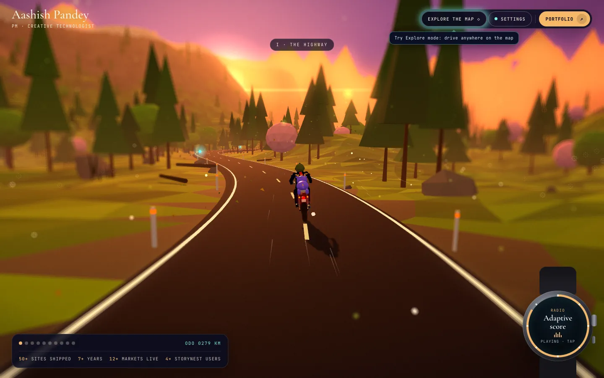

| | |
| --- | --- |
| 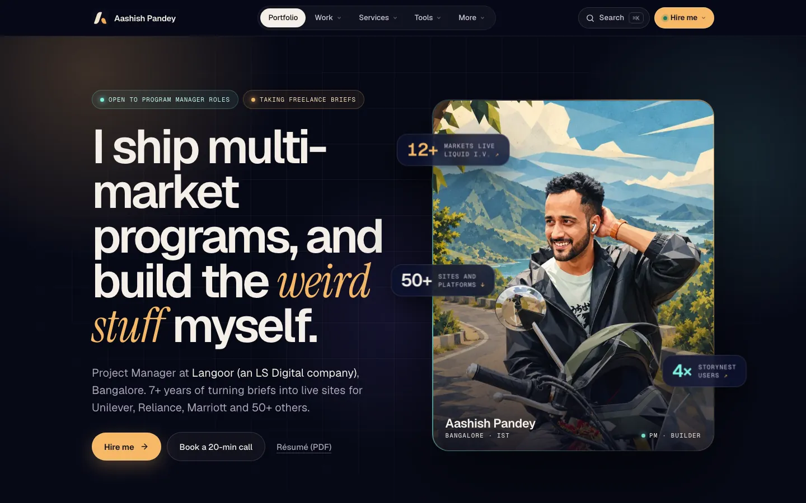 | 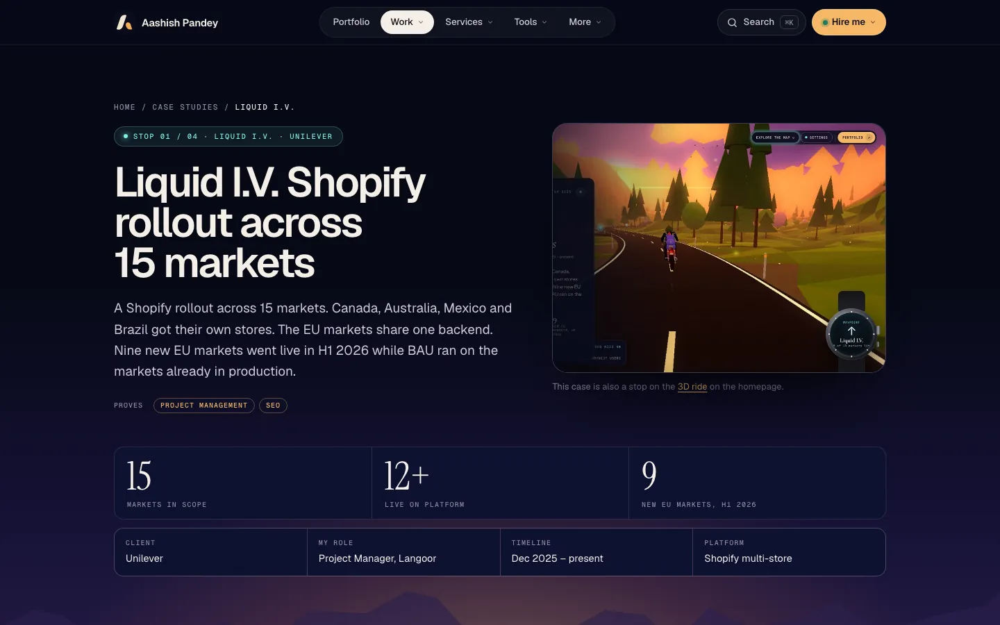 |
| `/portfolio` | `/work-liquid-iv` (one of four case studies) |

## Contents

- [What is in here](#what-is-in-here)
- [Free tools](#free-tools)
- [Architecture](#architecture)
- [The 3D ride](#the-3d-ride)
- [Backend](#backend)
- [Build pipeline](#build-pipeline)
- [SEO and structured data](#seo-and-structured-data)
- [Repository layout](#repository-layout)
- [Run it and check it](#run-it-and-check-it)
- [Adding a page or tool](#adding-a-page-or-tool)
- [Environment variables](#environment-variables)
- [Conventions](#conventions)
- [Known limits](#known-limits)

## What is in here

| Section | Routes | Notes |
| --- | --- | --- |
| Ride | `/` | Scroll-driven 3D ride with nine story stops, plus an Explore mode where you drive freely |
| Portfolio | `/portfolio`, `/case-studies`, `/work-*` | Client work, career, and four written case studies |
| Services | `/services` and seven sub-pages | Shopify, full-stack, WordPress and Webflow, SEO, UI/UX, tech consulting, freelance project management |
| Tools | `/tools` and `/tools/*` | 22 free tools, listed below |
| Write-up | `/how-this-site-was-built` | How the site was made |
| Legal and contact | `/contact`, `/privacy`, `/terms`, `/cookies`, `/image-license` | |

`vercel.json` holds the authoritative route map.

## Free tools

Most run entirely in the browser: no upload, no account. Two use a small server and say so on their pages.

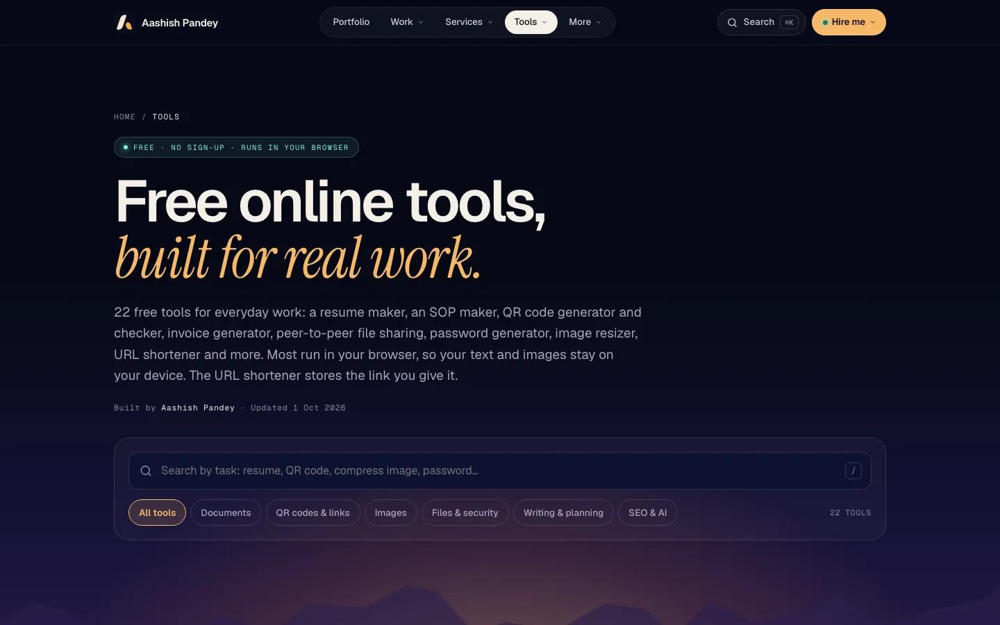

| Group | Tools |
| --- | --- |
| Documents and business | Resume maker (54 templates), resume keyword matcher, invoice generator, SOP maker (116 templates), project estimate calculator, website launch checklist, online notepad |
| Images and files | Image resizer and converter, exam photo and signature resizer, photo metadata (EXIF) remover, file hash checker, QR code generator, QR code checker |
| SEO and AI | robots.txt generator, llms.txt generator, JSON-LD schema generator, LLM token counter and API cost calculator |
| Sharing and utilities | P2P file sharing, URL shortener, time zone meeting planner, password generator, lorem ipsum generator |

| | |
| --- | --- |
| 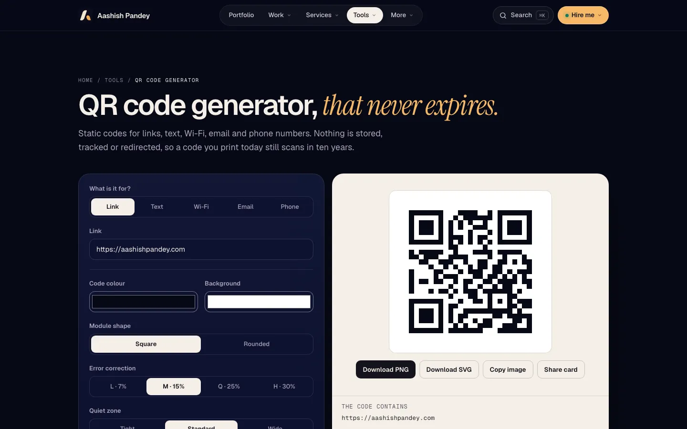 | 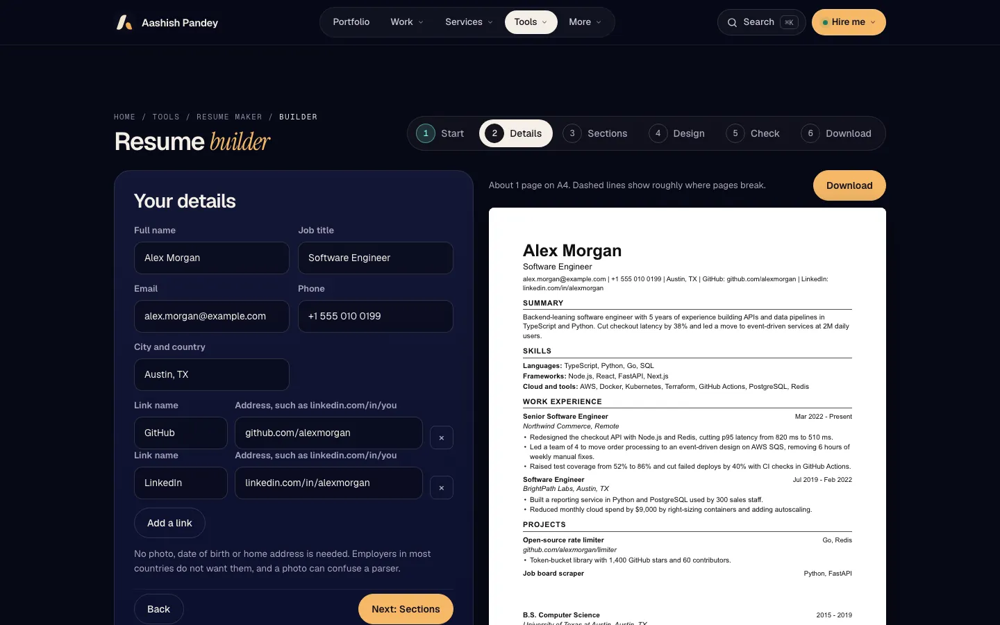 |
| QR codes for links, Wi-Fi, UPI, email; PNG and SVG | Resume builder: live preview, ATS checks, PDF and Word export |
| 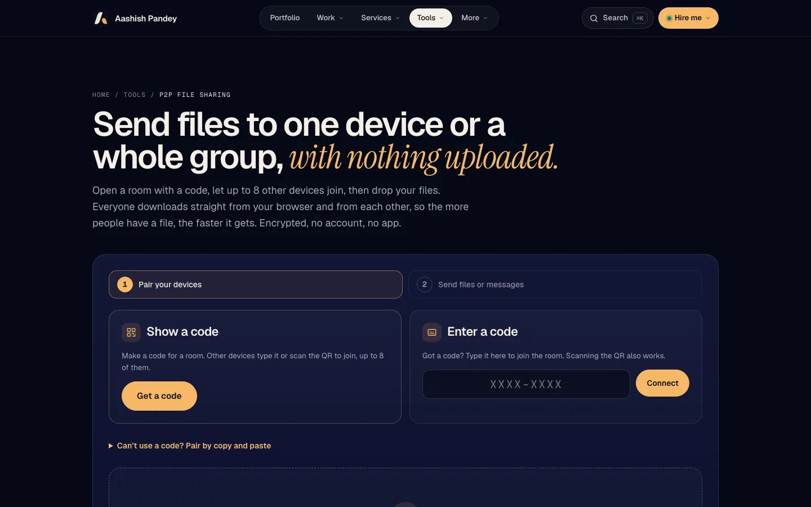 | 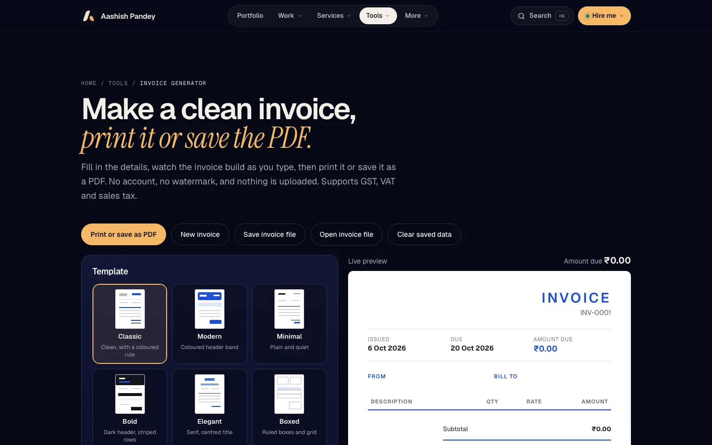 |
| Rooms of up to 9 devices, encrypted, swarm download | Six templates, 37 currencies, GST, VAT and sales tax |

### How a few of them work

- **Resume maker.** One renderer (`assets/resume-builder.js`) draws all templates. A template is a row in `TPLS` (layout, heading style, colours, ATS rating) plus CSS in `assets/resume.css`. The .docx is written by hand (a zip built in the browser). State lives in `localStorage`.
- **Invoice generator.** Amounts are worked in minor units to avoid float drift. Tax can be per line, one combined rate, or named components (CGST and SGST, GST and PST). Region presets set currency, labels and default rates. The PDF is the browser print dialog with print CSS.
- **Project estimate calculator.** Three-point (PERT) estimates per task: expected = (best + 4 x likely + worst) / 6, total spread from the root of summed variances, quotes at 50, 80, 90 and 95 percent confidence.
- **Exam photo resizer.** Crops to exact pixels or millimetres, then searches JPEG quality and scale to land inside a KB window. If the file is under the minimum it pads with JPEG comment segments.
- **Resume keyword matcher.** Reads PDF (vendored pdf.js 3.11) and DOCX in the browser, extracts keywords from a job description against a skills lexicon, and scores the match with ATS format checks.
- **File hash checker.** Web Crypto for SHA-1, SHA-256 and SHA-512, a hand-written MD5, files read in chunks.
- **Password generator.** `crypto.getRandomValues` with rejection sampling to avoid modulo bias.
- **URL shortener.** `POST /api/shorten`, stored in Upstash Redis with expiry; `GET /s/<code>` redirects and counts clicks.
- **Share cards.** `assets/share-card.js` draws a unique image per tool, per user, from live results on a canvas (for example the hash of the file you just checked), with a Share or Download button.

### P2P file sharing

Files go browser to browser over WebRTC data channels. The server only passes encrypted pairing messages and never sees file data.

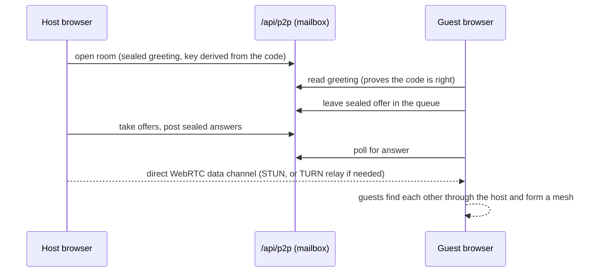

- **Rooms.** One host, up to 9 devices. Joining is guest-initiated through a mailbox. The room code never leaves the browser, and every message is encrypted with a key derived from it.
- **Swarm download.** Files are cut into pieces. A device with the whole file serves a fixed share of the pieces by class (`i % m === rank`), so the host uploads about 1x the file however many people join. Devices with part of a file are asked for the rarest pieces first. Missed pieces are re-requested after 2 seconds (endgame), and a stalled source falls back after 1.5 seconds.
- **Integrity.** Each piece is checked with SHA-256 before it is kept.
- **Storage.** Large files go to the Origin Private File System, one file per piece in a per-tab folder, cleaned up under a Web Lock. Small files stay in memory.
- **Worldwide.** `/api/p2p-ice` returns ICE servers: public STUN, plus TURN credentials from Cloudflare Realtime or Metered when configured, so devices on different networks still connect. Without TURN keys it works on most networks but not behind symmetric NAT.
- **Fallback.** Copy-and-paste pairing works with no server at all.

## Architecture

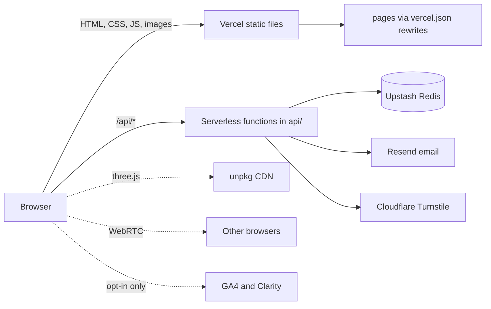

- **Static first.** No framework and no bundler. Pages are `.dc.html` files served as HTML. A small runtime (`assets/js/support.js`) fills `{{ }}` templates in the browser; newer tool pages are plain HTML with inline JS and need no runtime.
- **Crawlable by default.** At build time the first-paint content of each page is written into the HTML and the template is moved to a hashed `/tpl/*.js` file, so crawlers that do not run JavaScript still read real content.
- **Clean URLs by rewrite.** `cleanUrls` is off. Every route is a `vercel.json` rewrite from a clean path to a file under `pages/`.
- **Privacy by design.** Tool data stays on the device. Analytics (GA4 and Microsoft Clarity) only start after the visitor accepts the cookie notice, and Clarity is never loaded on pages where visitors type their own text or personal data.

## The 3D ride

- **Engine.** `assets/js/world-v7.js` (Three.js 0.184, loaded from unpkg) exports `createWorld(host, opts)`. It was generated from earlier versions and has since been edited in place; check `git log -- assets/js/world-v7.js` before assuming how it was produced.
- **Route.** A fixed road with nine numbered stops. Scrolling advances the bike along it. Explore mode lets you leave the road and drive anywhere on a map of about 1.85 by 2.7 km: jungle, savanna, blossom valley, a snow peak with an ice cave, and hidden stamps to find.
- **Physics.** Lateral grip limits turning by surface (road, dirt, sand, ice, reduced by rain and snow), braking is grip-limited, lean follows lateral acceleration through a spring-damper, and the front end steers on its own axis. The speedometer shows true speed x 6 by design.
- **Rendering.** Real bloom, height fog, depth-of-field blur, adaptive quality tiers that move on frame time, tiled lazy loading (160 m tiles), instancing and distance culling. On phones: no MSAA, a lower starting tier, and a shader warm-up before the first frame.
- **Audio.** `assets/js/audio-v3.js` is fully generative (no audio files): lydian chords through a convolution reverb, celesta, flute, kalimba and cricket foley, with positional stereo for the lake and campfire. It suspends when the tab is hidden or the phone locks. There is deliberately no speed-reactive engine sound.
- **MujaSauros (the dino).** A pet with moods, bond, pets, snacks and fetch. Its "mind" (`dinoPath`, `mindTick` in `world-v7.js`): it steers with look-ahead around trees, rocks, water and cliffs, only picks roam targets it can reach, remembers the places you visit and how you ride (counts saved on the device in `apDinoPlaces` and `apDinoStyle`), comments on both, and warns about water, drops and solids ahead of the bike.
- **Gamification.** XP, a daily challenge, stamps, a wildlife journal and postcards, all in `localStorage` with no network calls.
- **Performance work.** Profiling scripts are in `scripts/perf/`; results and method are in [docs/PERFORMANCE.md](docs/PERFORMANCE.md).

## Backend

Vercel serverless functions in `api/` (Node, no framework, no npm dependencies). State is in Upstash Redis over REST.

| Endpoint | Job |
| --- | --- |
| `POST /api/shorten`, `GET /s/:code` | URL shortener: aliases, expiry from 1 day to 1 year, click counts, rate limits per IP |
| `POST /api/p2p`, `GET /api/p2p` | Encrypted pairing mailbox for P2P rooms (15 minute TTL, queue of 24 offers, rate limits) |
| `GET /api/p2p-ice` | ICE server list including short-lived TURN credentials |
| `POST /api/contact` | Brief form: validation, honeypot, Turnstile, rate limit, mail to the owner and a confirmation to the sender |
| `POST /api/subscribe`, `GET /api/newsletter` | Newsletter: subscribe, confirm, one-click unsubscribe with signed links |
| `POST /api/resend-webhook` | Delivery, bounce and spam events from Resend, verified with the Svix signature |
| `GET /api/quote` | Public quote page with accept or decline, gated by a signed token |
| `GET /api/config`, `GET /api/health` | Public Turnstile site key; which settings are present (booleans only) |

A private admin lives behind an unlisted path (`admin/`, `api/_adm/`): an inbox and pipeline for enquiries (stages, deal value, a 48 hour reply promise, follow-ups, a morning digest), quotes, newsletter list, sent-mail log, sign-in history, TOTP two-factor sign-in (RFC 6238), "sign out everywhere", nightly backup, and Web Push notifications (VAPID, RFC 8291) with no dependencies. It is `noindex`, `no-store` and rate limited.

Redis keys used by the public tools:

| Key | Value |
| --- | --- |
| `s:<code>`, `c:<code>` | Short link JSON, click count |
| `p2p:o:<room>`, `p2p:j:<room>`, `p2p:a:<room>:<gid>` | Room greeting, queue of join offers, answer |
| `rl:*` | Rate-limit counters |

## Build pipeline

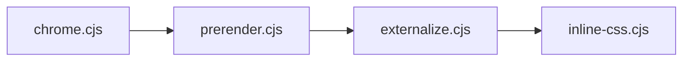

`npm run build` runs these in order (this is `buildCommand` in `vercel.json`):

| Script | Job |
| --- | --- |
| `scripts/chrome.cjs` | Generates the shared header, mega menus, mobile sheet and footer into marked regions on every page. `--check` fails if any page is stale |
| `scripts/prerender.cjs` | Resolves the home page template's control flow and writes a static first-paint block |
| `scripts/externalize.cjs` | Moves each page template into a hashed `/tpl/<Page>.<hash>.js` and keeps only the prerendered content in the HTML |
| `scripts/inline-css.cjs` | Inlines the navigation CSS to remove a render-blocking request |

Run by hand when needed:

| Script | Job |
| --- | --- |
| `scripts/sitemap.cjs` | Writes `seo/sitemap.xml` (an index) and per-type sitemaps. A page's `lastmod` moves only when its content really changes |
| `scripts/make-og.py` | Renders the 1200 by 630 Open Graph image for each page into `assets/og/` |
| `scripts/check-site.cjs` | Builds in a temp copy and checks links, assets, stylesheet versions, sitemaps, tool counts and structured data |
| `scripts/sop-pages.cjs` | Generates the four SOP maker pages and `assets/sop-templates.js` |
| `scripts/pages.cjs` | Helper that finds every page under `pages/` |

The build rewrites page sources in place, so do not run it in the checkout you plan to commit. `npm run check` does the build in a temporary copy.

CI (`.github/workflows/check.yml`) runs the same site check on every push and pull request.

## SEO and structured data

- Every page has a unique title and description, a self-referencing canonical, Open Graph and Twitter tags.
- Each page carries one linked JSON-LD graph: `Person` and `WebSite` shared across the site, plus a page-specific type (`WebApplication`, `HowTo`, `FAQPage` and `BreadcrumbList` for tools; `Article` for case studies; `Service` for service pages; `ItemList` on the tools hub).
- No dates on pages that do not show one, and no rating or review markup.
- Sitemaps are split by type under `seo/`; `robots.txt` names only the index. `llms.txt` summarises the site for AI assistants.
- Details and the checklist are in [docs/SEO.md](docs/SEO.md) and [docs/SEO-CHECKLIST.md](docs/SEO-CHECKLIST.md).

## Repository layout

```
pages/            page sources (.dc.html), grouped: site, services, work, tools (with resume and sop), legal
assets/           css, images, vendored libraries (pdf.js), tool scripts
assets/js/        site.js (routing shim, analytics, consent), support.js (page runtime), world-v7.js, audio-v3.js
api/              serverless functions; api/_adm is the private admin backend
admin/            private admin page, service worker and manifest (served at an unlisted path)
seo/              sitemaps, robots.txt, llms.txt (served at their usual URLs by vercel.json rewrites)
scripts/          build, sitemap, OG image and check scripts
docs/             setup, SEO and performance notes, README images
vercel.json       routes, redirects, headers, crons and the build command
404.html          not-found page (Vercel needs it at the root)
```

Page file names are unique across `pages/`. Pages under `/tools/*` must use absolute asset paths (`/assets/...`), because a relative path resolves against `/tools/`.

## Run it and check it

Requirements: Node 20 or newer. There are no npm dependencies.

```
npm run chrome:check   # is every page's header and footer current?
npm run check          # full site check in a temporary copy
```

The site is static, so any static server that applies the `vercel.json` rewrites works for a local look. Opening a `.dc.html` file directly also works in preview mode (`assets/js/site.js` carries a small routes table for that).

More in [docs/SETUP.md](docs/SETUP.md): deploying from scratch, moving host, DNS, checks after a deploy, and rolling back.

## Adding a page or tool

1. Add the page under `pages/<group>/` and a `rewrites` entry in `vercel.json`.
2. Add the route to `ROUTES` in `assets/js/site.js`.
3. Add it to the menus and `TOOL_ORDER` in `scripts/chrome.cjs`, then run `node scripts/chrome.cjs`.
4. Add it to `scripts/sitemap.cjs` and `scripts/make-og.py`, then run both.
5. For a tool: add the card, `TOOLS` entry and ItemList item in `pages/tools/Tools-v3.dc.html`.
6. Update the "Free tools" list in `seo/llms.txt`.
7. Run `npm run check`.

## Environment variables

Set in Vercel. Each feature switches off or falls back when its variables are missing.

| Variable | Used by |
| --- | --- |
| `UPSTASH_REDIS_REST_URL`, `UPSTASH_REDIS_REST_TOKEN` | URL shortener, P2P pairing, rate limits, admin data |
| `CF_TURN_KEY_ID`, `CF_TURN_API_TOKEN` | P2P relay across different networks (Cloudflare Realtime TURN) |
| `METERED_APP`, `METERED_API_KEY` | Same relay, Metered as the alternative |
| `RESEND_API_KEY`, `RESEND_FROM`, `RESEND_AUDIENCE_ID`, `RESEND_WEBHOOK_SECRET` | Email: contact form, newsletter, delivery events |
| `TURNSTILE_SITEKEY`, `TURNSTILE_SECRET` | Bot protection on forms |
| `ADMIN_EMAIL`, `ADMIN_PASSWORD`, `ADMIN_SECRET`, `CRON_SECRET`, `NEWSLETTER_SECRET` | Admin sign-in, signed links and the scheduled jobs |

Never commit values. `vercel.json` also schedules two cron jobs (a nightly job and a morning digest).

## Conventions

- Stay inside the site's visual language (dark "Night Ride" palette, Geist and Geist Mono, one accent). No emoji and no em dashes in site copy.
- Honest claims only: no invented ratings, reviews or placements.
- Tool pages state precisely what leaves the device (usually nothing, apart from consent-gated analytics).
- Do not commit `CLAUDE.md` or hand-off notes: Vercel serves the repo root, so they would be public.

## Known limits

- The 3D ride is tuned by measurement and screenshots; smoothness on low-end phones is not guaranteed.
- LLM token counts are estimates (roughly 10 to 15 percent off real tokenizers) and the example prices need updating from time to time.
- P2P across restrictive networks needs TURN keys configured.
- HEIC input in the exam photo resizer works only where the browser can decode it (Safari).

## Licence

Code and content are copyright Aashish Pandey, all rights reserved, except vendored libraries in `assets/vendor/` (pdf.js, Apache-2.0), which keep their own licences.
